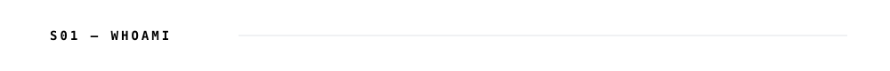
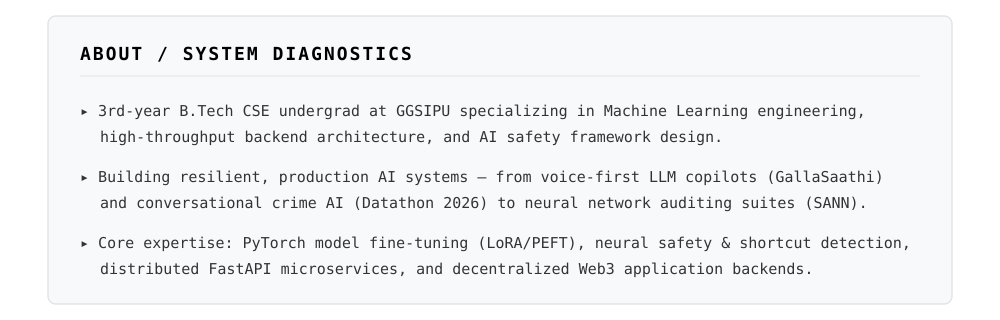
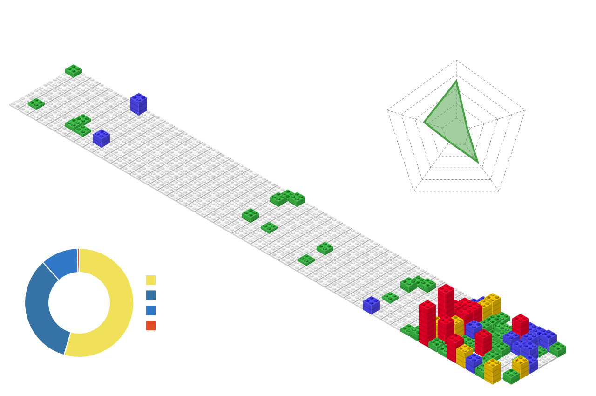

<picture><source media="(prefers-color-scheme: dark)" srcset="assets/dark/header-v1.svg"/></picture>

<picture><source media="(prefers-color-scheme: dark)" srcset="assets/dark/s01.svg"/></picture>
<picture><source media="(prefers-color-scheme: dark)" srcset="assets/dark/whoami.svg"/></picture>

 

<a href="https://drive.google.com/file/d/1Z_oiTt0xa8733B-JupRAk3ohW_P-XQIx/view?usp=sharing"><picture><source media="(prefers-color-scheme: dark)" srcset="https://img.shields.io/badge/RESUME-0d1117?style=flat-square&logo=adobeacrobatreader&logoColor=ffffff"/></picture></a>
<a href="https://www.linkedin.com/in/garv-nanda-4106b6336"><picture><source media="(prefers-color-scheme: dark)" srcset="https://img.shields.io/badge/LINKEDIN-0d1117?style=flat-square&logo=linkedin&logoColor=ffffff"/></picture></a>
<a href="https://www.instagram.com/garvnandaa/"><picture><source media="(prefers-color-scheme: dark)" srcset="https://img.shields.io/badge/INSTAGRAM-0d1117?style=flat-square&logo=instagram&logoColor=ffffff"/></picture></a>
<a href="mailto:garvnanda326@gmail.com"><picture><source media="(prefers-color-scheme: dark)" srcset="https://img.shields.io/badge/EMAIL-0d1117?style=flat-square&logo=gmail&logoColor=ffffff"/></picture></a>
<a href="https://wa.me/919319148946"><picture><source media="(prefers-color-scheme: dark)" srcset="https://img.shields.io/badge/WHATSAPP-0d1117?style=flat-square&logo=whatsapp&logoColor=ffffff"/></picture></a>

<picture><source media="(prefers-color-scheme: dark)" srcset="assets/dark/s02.svg"/></picture>
<picture><source media="(prefers-color-scheme: dark)" srcset="assets/dark/stack.svg"/></picture>

<picture><source media="(prefers-color-scheme: dark)" srcset="assets/dark/s03-ttt.svg"/></picture>

**Tic-Tac-Toe** — shared board, click a cell to play the next mark

<picture><source media="(prefers-color-scheme: dark)" srcset="assets/dark/s03.svg"/></picture>
<picture><source media="(prefers-color-scheme: dark)" srcset="assets/dark/projects.svg"/></picture>

  

<picture><source media="(prefers-color-scheme: dark)" srcset="assets/dark/s04.svg"/></picture>

<picture><source media="(prefers-color-scheme: dark)" srcset="assets/dark/telemetry.svg"/></picture>

<picture><source media="(prefers-color-scheme: dark)" srcset="assets/dark/github-stats.svg"/></picture>

<picture><source media="(prefers-color-scheme: dark)" srcset="https://github-readme-activity-graph.vercel.app/graph?username=Garvnanda&bg_color=00000000&color=ffffff&line=ffffff&point=ffffff&area_color=ffffff&area=true&hide_border=true&radius=0&custom_title=CONTRIBUTION%20TELEMETRY"/></picture>

**3D Contribution Calendar** — rebuilt daily from live commit history

<picture><source media="(prefers-color-scheme: dark)" srcset="assets/dark/s05.svg"/></picture>

<picture><source media="(prefers-color-scheme: dark)" srcset="assets/dark/commits.svg"/></picture>

<picture><source media="(prefers-color-scheme: dark)" srcset="assets/dark/s07-tree.svg"/></picture>

<picture><source media="(prefers-color-scheme: dark)" srcset="assets/dark/tree.svg"/></picture>

<picture><source media="(prefers-color-scheme: dark)" srcset="assets/dark/divider.svg"/></picture>

<picture><source media="(prefers-color-scheme: dark)" srcset="assets/dark/s06.svg"/></picture>

**Play me at Chess**

<!-- CHESS_START -->

  <b>Click any move badge to play against Garv's AI Bot</b> 
  white to move · 29 legal moves shown below · replies instantly

<table border="0">
<tr>
<td align="center" valign="middle">
                            
</td>
<td align="center" valign="middle" width="560">

</td>
<td align="center" valign="middle">
                          
</td>
</tr>
</table>
<!-- CHESS_END -->

<picture><source media="(prefers-color-scheme: dark)" srcset="assets/dark/footer.svg"/></picture>

<picture><source media="(prefers-color-scheme: dark)" srcset="assets/dark/divider.svg"/></picture>

**Feedback** — leave a note for whoever's next

