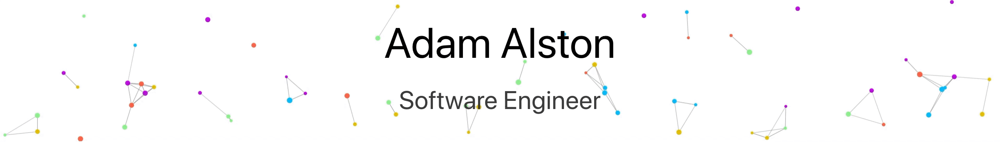

<picture>
  <source media="(prefers-color-scheme: dark)" srcset="assets/dark/cover.gif"/>
  
</picture>

  

<picture>
  <source media="(prefers-color-scheme: dark)" srcset="assets/dark/header-v1.svg"/>
  
</picture>

  </img>

  

<a href="https://drive.google.com/file/d/1Z_oiTt0xa8733B-JupRAk3ohW_P-XQIx/view?usp=sharing"><picture><source media="(prefers-color-scheme: dark)" srcset="https://img.shields.io/badge/RESUME-0d1117?style=flat-square&logo=adobeacrobatreader&logoColor=ffffff"/></picture></a>
&nbsp;
<a href="https://www.linkedin.com/in/garv-nanda-4106b6336"><picture><source media="(prefers-color-scheme: dark)" srcset="https://img.shields.io/badge/LINKEDIN-0d1117?style=flat-square&logo=linkedin&logoColor=ffffff"/></picture></a>
&nbsp;
<a href="mailto:garvnanda326@gmail.com"><picture><source media="(prefers-color-scheme: dark)" srcset="https://img.shields.io/badge/EMAIL-0d1117?style=flat-square&logo=gmail&logoColor=ffffff"/></picture></a>
&nbsp;
<a href="https://www.instagram.com/garvnandaa/"><picture><source media="(prefers-color-scheme: dark)" srcset="https://img.shields.io/badge/INSTAGRAM-0d1117?style=flat-square&logo=instagram&logoColor=ffffff"/></picture></a>
&nbsp;
<a href="https://wa.me/919319148946"><picture><source media="(prefers-color-scheme: dark)" srcset="https://img.shields.io/badge/WHATSAPP-0d1117?style=flat-square&logo=whatsapp&logoColor=ffffff"/></picture></a>

 

<picture><source media="(prefers-color-scheme: dark)" srcset="assets/dark/s01.svg"/></picture>
<picture><source media="(prefers-color-scheme: dark)" srcset="assets/dark/whoami.svg"/></picture>

<picture><source media="(prefers-color-scheme: dark)" srcset="assets/dark/s02.svg"/></picture>
<picture><source media="(prefers-color-scheme: dark)" srcset="assets/dark/ecosystem.svg"/></picture>

<picture><source media="(prefers-color-scheme: dark)" srcset="assets/dark/s03.svg"/></picture>
<picture><source media="(prefers-color-scheme: dark)" srcset="assets/dark/projects.svg"/></picture>

### Featured Repositories

| Repository | Focus &amp; Architecture | Primary Tech |
| :--- | :--- | :--- |
| [**`DATATHON-2026`**](https://github.com/Garvnanda/DATATHON-2026) | Conversational AI &amp; Decision Support System for KSP Crime Database | FastAPI, Gemma LLM, NetworkX, Streamlit, Zoho Catalyst |
| [**`debatemind`**](https://github.com/Garvnanda/debatemind) | AI-Powered Debate Analysis &amp; Counter-Argument Generator | Python, NLP, LLMs, Speech Analysis |
| [**`devlens`**](https://github.com/Garvnanda/devlens) | Developer Productivity &amp; Codebase AST Telemetry Suite | Python, AST Parser, Static Analysis |
| [**`SANN`**](https://github.com/Garvnanda/SANN) | Self-Auditing Neural Networks — AI Safety &amp; Poisoning Detector | PyTorch, Hugging Face, Poisoning Detector |
| [**`CREATOR_X`**](https://github.com/Garvnanda/CREATOR_X) | Decentralized SocialFi Web3 &amp; Mobile Application Platform | Solidity, Web3.js, Node.js, React Native |
| [**`galla-sathi`**](https://github.com/Garvnanda/galla-sathi) | Voice-First AI Copilot for Kirana Shopkeepers | TypeScript, FastAPI, Gemma 4, Sarvam ASR, Supabase |

 

<picture><source media="(prefers-color-scheme: dark)" srcset="assets/dark/s04.svg"/></picture>
<picture><source media="(prefers-color-scheme: dark)" srcset="assets/dark/telemetry.svg"/></picture>

  
  &nbsp;&nbsp;
  

 

<picture>
  <source media="(prefers-color-scheme: dark)" srcset="https://github-readme-activity-graph.vercel.app/graph?username=Garvnanda&bg_color=00000000&color=ffffff&line=ffffff&point=ffffff&area_color=ffffff&area=true&hide_border=true&radius=0&custom_title=CONTRIBUTION%20TELEMETRY"/>
  
</picture>

 

<picture><source media="(prefers-color-scheme: dark)" srcset="assets/dark/s05.svg"/></picture>
<picture><source media="(prefers-color-scheme: dark)" srcset="assets/dark/timeline.svg"/></picture>
<picture><source media="(prefers-color-scheme: dark)" srcset="assets/dark/experience.svg"/></picture>

<picture><source media="(prefers-color-scheme: dark)" srcset="assets/dark/s06.svg"/></picture>
<picture><source media="(prefers-color-scheme: dark)" srcset="assets/dark/stack.svg"/></picture>

<picture><source media="(prefers-color-scheme: dark)" srcset="assets/dark/footer.svg"/></picture>
