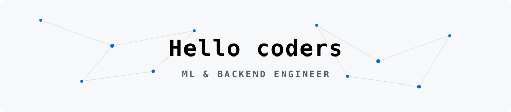
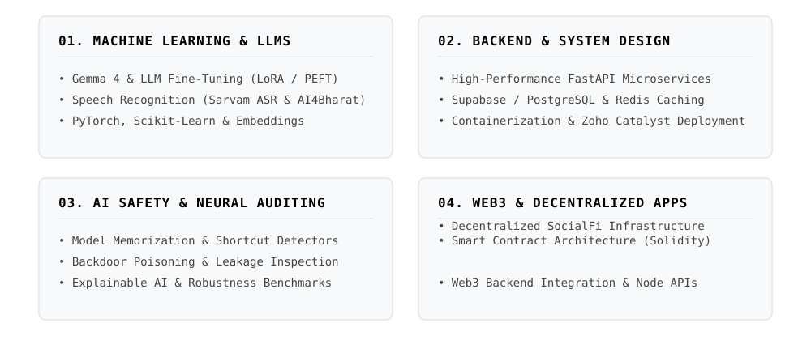
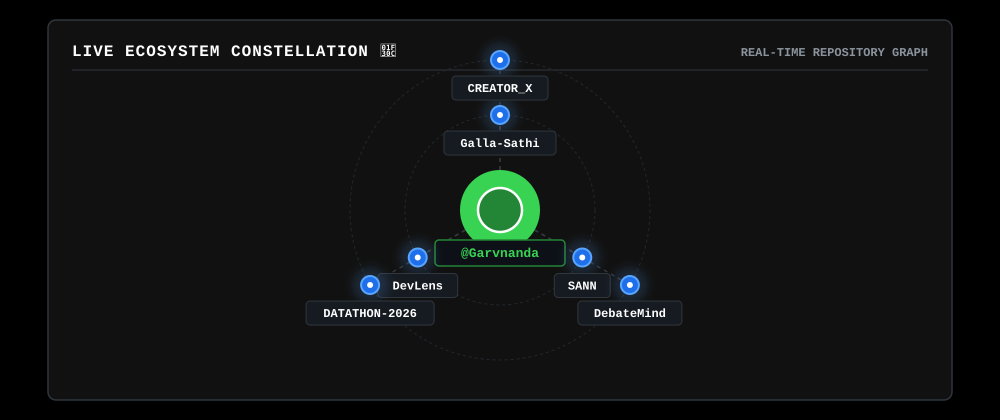

<picture>
  <source media="(prefers-color-scheme: dark)" srcset="assets/dark/cover-banner.svg"/>
  
</picture>

  

<picture>
  <source media="(prefers-color-scheme: dark)" srcset="assets/dark/header-v1.svg"/>
  
</picture>

  

  </img>

<a href="https://drive.google.com/file/d/1Z_oiTt0xa8733B-JupRAk3ohW_P-XQIx/view?usp=sharing"><picture><source media="(prefers-color-scheme: dark)" srcset="https://img.shields.io/badge/RESUME-0d1117?style=flat-square&logo=adobeacrobatreader&logoColor=ffffff"/></picture></a>
&nbsp;
<a href="https://www.linkedin.com/in/garv-nanda-4106b6336"><picture><source media="(prefers-color-scheme: dark)" srcset="https://img.shields.io/badge/LINKEDIN-0d1117?style=flat-square&logo=linkedin&logoColor=ffffff"/></picture></a>
&nbsp;
<a href="mailto:garvnanda326@gmail.com"><picture><source media="(prefers-color-scheme: dark)" srcset="https://img.shields.io/badge/EMAIL-0d1117?style=flat-square&logo=gmail&logoColor=ffffff"/></picture></a>
&nbsp;
<a href="https://www.instagram.com/garvnandaa/"><picture><source media="(prefers-color-scheme: dark)" srcset="https://img.shields.io/badge/INSTAGRAM-0d1117?style=flat-square&logo=instagram&logoColor=ffffff"/></picture></a>
&nbsp;
<a href="https://wa.me/919319148946"><picture><source media="(prefers-color-scheme: dark)" srcset="https://img.shields.io/badge/WHATSAPP-0d1117?style=flat-square&logo=whatsapp&logoColor=ffffff"/></picture></a>

 

<picture><source media="(prefers-color-scheme: dark)" srcset="assets/dark/s01.svg"/></picture>
<picture><source media="(prefers-color-scheme: dark)" srcset="assets/dark/whoami.svg"/></picture>

<picture><source media="(prefers-color-scheme: dark)" srcset="assets/dark/s02.svg"/></picture>
<picture><source media="(prefers-color-scheme: dark)" srcset="assets/dark/ecosystem.svg"/></picture>
<picture><source media="(prefers-color-scheme: dark)" srcset="assets/dark/dynamic/constellation.svg"/></picture>

<picture><source media="(prefers-color-scheme: dark)" srcset="assets/dark/s03.svg"/></picture>
<picture><source media="(prefers-color-scheme: dark)" srcset="assets/dark/projects.svg"/></picture>

&nbsp;

&nbsp;

  

&nbsp;

&nbsp;

 

<picture><source media="(prefers-color-scheme: dark)" srcset="assets/dark/s04.svg"/></picture>
<picture><source media="(prefers-color-scheme: dark)" srcset="assets/dark/telemetry.svg"/></picture>

<picture><source media="(prefers-color-scheme: dark)" srcset="assets/dark/github-stats.svg"/></picture>

  

<!-- LIVE-TYPING IDE TERMINAL -->
<picture><source media="(prefers-color-scheme: dark)" srcset="assets/dark/dynamic/terminal.svg"/></picture>

  

<!-- REAL-TIME GITHUB CONTRIBUTION ACTIVITY GRAPH -->
<picture>
  <source media="(prefers-color-scheme: dark)" srcset="https://github-readme-activity-graph.vercel.app/graph?username=Garvnanda&bg_color=00000000&color=ffffff&line=ffffff&point=ffffff&area_color=ffffff&area=true&hide_border=true&radius=0&custom_title=CONTRIBUTION%20TELEMETRY"/>
  
</picture>

  

 

<!-- CHESS_START -->
<picture><source media="(prefers-color-scheme: dark)" srcset="assets/dark/s07.svg"/></picture>

  <b>Click any move badge below to play against Garv's AI Bot</b> 
  AI responds automatically in ~10s • Board resets automatically on new repository creation

<table border="0">
<tr>
<td align="center" valign="middle">
          
</td>
<td align="center" valign="middle" width="520">
  <picture>
    <source media="(prefers-color-scheme: dark)" srcset="https://raw.githubusercontent.com/Garvnanda/Garvnanda/main/assets/dark/chess_board.svg?v=1785355584"/>
    
  </picture>
</td>
<td align="center" valign="middle">
          
</td>
</tr>
</table>

<!-- CHESS_END -->

 

<picture><source media="(prefers-color-scheme: dark)" srcset="assets/dark/s05.svg"/></picture>
<picture><source media="(prefers-color-scheme: dark)" srcset="assets/dark/timeline.svg"/></picture>
<picture><source media="(prefers-color-scheme: dark)" srcset="assets/dark/experience.svg"/></picture>

<picture><source media="(prefers-color-scheme: dark)" srcset="assets/dark/s06.svg"/></picture>
<picture><source media="(prefers-color-scheme: dark)" srcset="assets/dark/stack.svg"/></picture>

 

<picture><source media="(prefers-color-scheme: dark)" srcset="assets/dark/footer.svg"/></picture>
